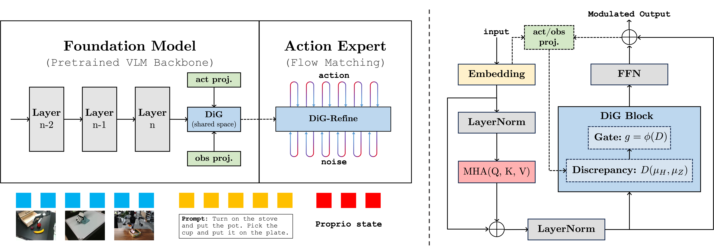

# Transport Discrepancy as a Reliability Signal for Vision-Language-Action Models

<div align="center">

**[Wanpeng Zhang](https://zhangwp.com)<sup>1,3</sup>, [Ye Wang](https://scholar.google.com/citations?user=RTuvoywAAAAJ)<sup>2,3</sup>, [Hao Luo](https://scholar.google.com/citations?user=TwuNaTYAAAAJ)<sup>1,3</sup>, [Haoqi Yuan](https://yhqpkueecs.github.io)<sup>1,3</sup>, [Yicheng Feng](https://takenpeanut.github.io)<sup>1,3</sup>,**<br>
**[Chaoyi Xu](https://co1one.github.io)<sup>1,3</sup>, [Sipeng Zheng](https://zhengsipeng.github.io)<sup>3</sup>, [Qin Jin](https://www.jin-qin.com)<sup>2</sup>, [Zongqing Lu](https://z0ngqing.github.io)<sup>1,3†</sup>**

**<sup>1</sup>Peking University** &nbsp;&nbsp;
**<sup>2</sup>Renmin University of China** &nbsp;&nbsp;
**<sup>3</sup>BeingBeyond**

<br>

[](https://research.beingbeyond.com/dig)
[](https://arxiv.org/abs/2512.01715)

</div>

<p align="center">
    
</p>

**DiG (Discrepancy Gate)** is a lightweight plug-in module for flow-matching vision-language-action (VLA) policies. It treats transport discrepancy between observation-side backbone features and an action-side representation as an internal reliability signal. DiG computes a sliced Wasserstein transport cost, maps it to a gate, and uses the gate to modulate residual feature refinement and the flow-matching training loss. At inference time, the same signal enables **DiG-Refine**, an iterative procedure that refines uncertain action chunks before execution.

DiG integrates naturally into recent flow-matching VLA architectures, including **π0.5**, **GR00T-N1**, and [**Being-H**](https://github.com/BeingBeyond/Being-H), and improves robustness under distribution shift and long-horizon rollouts.

## News

- **[2026-06-18]**: DiG has been accepted to **ECCV 2026**.
- **[2025-12-01]**: We released the DiG paper on [arXiv](https://arxiv.org/abs/2512.01715).

## Citation

If you find our work useful, please consider citing us and giving a star to this repository.

```bibtex
@inproceedings{zhang2026transport,
  title={Transport Discrepancy as a Reliability Signal for Vision-Language-Action Models},
  author={Wanpeng Zhang and Ye Wang and Hao Luo and Haoqi Yuan and Yicheng Feng and Chaoyi Xu and Sipeng Zheng and Qin Jin and Zongqing Lu},
  booktitle={European Conference on Computer Vision (ECCV)},
  year={2026}
}
```
